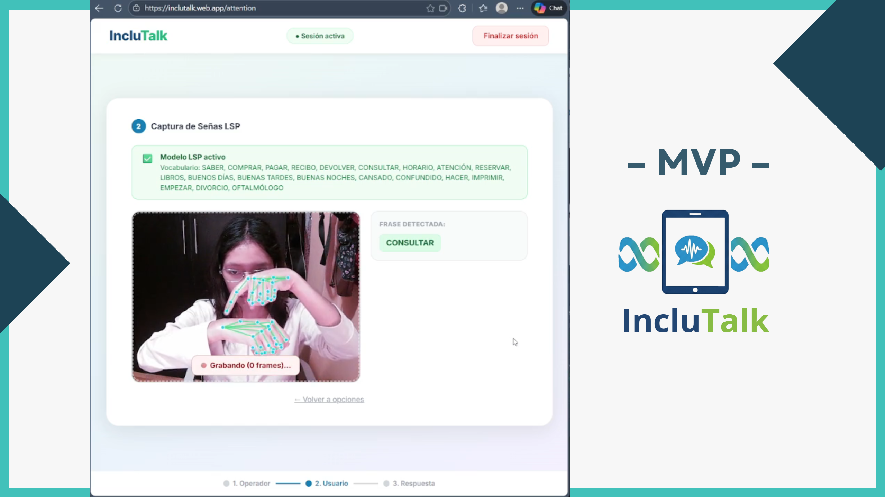

[;Clean+Architecture+%26+DDD;Competitive+programmer+%26+lifelong+learner;AI+%7C+Networks+enthusiast;Building+impactful+solutions+with+purpose+%F0%9F%92%9C)](https://git.io/typing-svg)

---

### 🔮 About me

Software Engineer passionate about building products with real impact. I focus on full-stack development, from backend architecture to user-facing applications.

Currently building projects like IncluTalk and TuTutoría, combining technology and entrepreneurship to solve real-world problems.

I have hands-on experience in process automation (including projects with Primax) and work as a part-time lecturer at UPC, teaching programming fundamentals.

I’m driven by building scalable solutions, learning fast, and turning ideas into real products.

---

### 🛠️ Tech Arsenal

**Architecture & Design Patterns**

> `Clean Architecture` `Domain-Driven Design (DDD)` `CQRS` `Repository Pattern` `Microservices` `Anti-Corruption Layers`

**Backend**

**Frontend & Mobile**

**Cloud, DevOps & Tools**

 
**Databases**

---

### 🚀 Featured projects
 
<table>
  <tr>
    <td align="center" width="50%">
      <h3>🤟 IncluTalk</h3>
      
        
      
      
      
        
      AI platform trained on <b>Peruvian Sign Language</b> to break communication barriers for the deaf community.
        
      <code>React</code> <code>Python</code> <code>PostgreSQL</code> <code>AI/ML</code> <code>TensorFlow</code> <code>Docker</code>
    </td>
    <td align="center" width="50%">
      <h3>🏪 ReStock</h3>
      
        
      
      
      
      
        
      Full-stack restaurant inventory system connecting admins with their suppliers — streamlining stock management end to end.
        
      <code>Angular</code> <code>Spring Boot</code> <code>Flutter</code> <code>Kotlin</code> <code>Mongo DB</code> <code>Docker</code>
    </td>
  </tr>
  <tr>
    <td align="center" width="50%">
      <h3>📚 TuTutoría</h3>
      
        
      
      
      
        
      Platform connecting students who need academic help with tutors who want to earn income. <i>🏆 Jury recognition @ TEC de Monterrey</i>
        
      <code>Angular</code> <code>Spring Boot</code> <code>Firebase</code> <code>GCP</code>
    </td>
    <td align="center" width="50%">
      <h3>🎵 BeatNet</h3>
      
        
      
      
        
      Music recommendation app powered by <b>graph models</b> — find your next favorite track through smart connections.
        
      <code>Vue</code> <code>Python</code> <code>Graph Algorithms</code>
    </td>
  </tr>
</table>

---

### 📊 GitHub stats

&nbsp;&nbsp;

---

### 🔗 Let's connect
 

 
 
 

&nbsp;

 
 
 

&nbsp;

&nbsp;

 

 
*✦ always learning · always building ✦*
 

